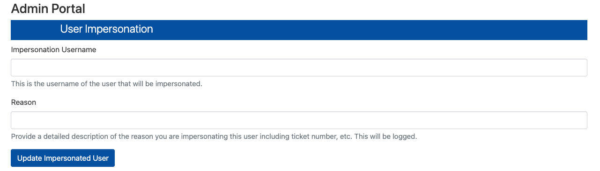

# OpenOnDemand Admin Apps
A collection of administrative tools for OpenOnDemand (OOD) at Idaho National Laboratory.

## Authors
Brandon Biggs (Brandon.Biggs@inl.gov) - Idaho National Laboratory

Please reach out if you run into any issues.


## Directory Structure

```
public_ondemand_admin/
├── bin/
│   └── ood_auth_map.regex              # Bash script for authentication mapping
├── user_impersonation_dashboard/
│   ├── env                             # Environment configuration
│   ├── initializers/
│   │   ├── admin.rb                    # Rails controller and model logic
│   │   └── routes.rb                   # Route configuration with access control
│   └── views/
│       └── index.html.erb              # Web UI template
├── LICENSE
├── NOTICE.txt
└── README.md
```

---

## Applications

### User Impersonation Dashboard


A web-based admin page accessible directly from the OOD interface that allows HPC cluster administrators to:

- Impersonate any user account in the OpenOnDemand environment
- Record audit logs of all impersonation attempts with required justification
- Dynamically update authentication mappings for the impersonated user

#### Components

##### Authentication Mapping Script (`bin/ood_auth_map.regex`)

A Bash script that handles the core authentication mapping mechanism:

- Decodes the current login username
- Checks if the user matches a configured service account pattern (e.g., `ood-service-hpcuser`)
- Retrieves and applies the impersonated username from environment variables
- Returns the appropriate username for the session

You will need to update this to work with your current authentication mapping.

##### Admin Dashboard (`user_impersonation_dashboard/`)

A Ruby on Rails integration that adds admin routes to the OpenOnDemand dashboard:

- **Access Control**: Routes are only available to users in the `OOD_ADMIN_GROUP`
- **Form Interface**: Provides fields for target username and impersonation reason
- **Audit Logging**: Records all impersonation attempts with timestamps and justifications

#### Service Accounts

You will need to create service accounts for each admin user that you want to have impersonation privileges; i.e. `admin1 --> ood-service-admin1`, `admin2 --> ood-service-admin2`, etc. These accounts should follow a pattern that you can set within the `bin/ood_auth_map.regex`. Your site may not support dashes or other characters in usernames, so adjust accordingly. The service accounts **do not** need to be a part of the `OOD_ADMIN_GROUP`.

#### Installation

1. Copy the `user_impersonation_dashboard` directory contents to your OOD dashboard configuration:

   ```bash
   ## Environment variables (see Configuration section below)
   cat /tmp/HPC_OOD_ADMIN/user_impersonation_dashboard/env >> /etc/ood/config/apps/dashboard/env

   ## Initializers with the impersonation code and to enable the /admin route for admin users
   cp /tmp/HPC_OOD_ADMIN/user_impersonation_dashboard/initializers/admin.rb  /etc/ood/config/apps/dashboard/initializers/admin.rb
   cp /tmp/HPC_OOD_ADMIN/user_impersonation_dashboard/initializers/routes.rb /etc/ood/config/apps/dashboard/initializers/routes.rb

   ## View to render the impersonation interface in the dashboard
   mkdir -p /etc/ood/config/apps/dashboard/views/admin/
   cp /tmp/HPC_OOD_ADMIN/user_impersonation_dashboard/views/index.html.erb   /etc/ood/config/apps/dashboard/views/admin/index.html.erb

   ## Or do this if you aren't worried about clobbering files
   # cp -r user_impersonation_dashboard/* /etc/ood/config/apps/dashboard/
   ```

2. Copy the authentication mapping script to the OOD auth map directory. PLEASE double check this as to not overwrite your potentially custom settings.

   ```bash
   cp bin/ood_auth_map.regex /opt/ood/ood_auth_map/bin/
   chmod 777 /opt/ood/ood_auth_map/bin/ood_auth_map.regex
   ```

You will have to tailor the regex or the `CURRENT_USER` variable to return the correct username. For example, 

```
CURRENT_USER=${CURRENT_USER//\@yourinstitution.edu/}
```

will remove `@yourinstitution.edu` from the username. If you don't get it right, you will get the dreaded `Error -- can't find user for ...` message when trying to log in. Just adjust the file and try again.

If you don't currently use a custom mapping script, be sure to enable this in your `ood_portal.yml` file:

```yml
# System command used to map authenticated-user to system-user
# This option takes precedence over user_map_match
# Example:
#     user_map_cmd: '/usr/local/bin/ondemand-usermap'
# Default: null (use user_map_match)
user_map_cmd: "/opt/ood/ood_auth_map/bin/ood_auth_map.regex"
```

**You will need to regenerate your portal and restart `httpd` if this is the first time enabling your custom mapping script.** If you already had custom mapping in place, then you can skip to Step 3!

First, update the Apache configuration file:

```sh
/opt/ood/ood-portal-generator/sbin/update_ood_portal
```

and then restart the Apache service for the changes to take effect:

```sh
systemctl restart httpd
systemctl restart htcacheclean
```

3. Create the log file with appropriate permissions. This may change depending on what you set in `ENV`.

   ```bash
   touch /var/log/ood-impersonation.log
   chown apache:apache /var/log/ood-impersonation.log
   chmod 664 /var/log/ood-impersonation.log
   ```

4. Ensure the `OOD_ADMIN_GROUP` environment variable is set in your OOD configuration to specify which group has admin access.

#### Configuration

The `env` file contains the following environment variables:

| Variable | Description | Default |
|----------|-------------|---------|
| `OOD_DASHBOARD_ADMIN_AUTH_MAP_FILE` | Path to the authentication mapping script | `/opt/ood/ood_auth_map/bin/ood_auth_map.regex` |
| `OOD_DASHBOARD_ADMIN_AUTH_LOG_FILE` | Path to the impersonation audit log | `/var/log/ood-impersonation.log` |

As explained above, be sure to modify the `ood_auth_map.regex` with your site-specific regex. You'll also need to set your authorized users,

```sh
# Set the user that will be impersonated
hpcuser_IMPERSONATION="USER_WHO_WILL_BE_IMPERSONATED"

authorized_users=("hpcuser")
```

like this,

```sh
admin1_IMPERSONATION="ood-service-admin1"
admin2_IMPERSONATION="ood-service-admin2"
...

authorized_users=("admin1" "admin2" ...)
```

#### Usage

1. Log into the OpenOnDemand dashboard as an admin user (member of `OOD_ADMIN_GROUP`)
2. Navigate to `/admin` in the dashboard
3. Enter the username to impersonate
4. Provide a reason for the impersonation (e.g., ticket number, debugging purpose)
5. Submit the form

The system will update the authentication mapping and log the action. The next session created through the configured service account will run as the impersonated user.

#### Security

- **Access Control**: Admin routes are only loaded for users in the designated admin group
- **Audit Trail**: All impersonation attempts are logged with:
  - Timestamp
  - Admin user performing the action
  - Target user being impersonated
  - Stated reason/justification
- **Input Validation**: Both username and reason fields are required

##### SELinux

You will most likely run into some problems with SELinux if you have it enabled. Here is an example policy that should cover the interactions between `ood_pun_t` and the new files. **Triple check these settings before applying!**

```sh
cat << EOF > /tmp/ood_admin_policy.te
module ood_admin_policy 1.0;

require {
        type ood_pun_t;
        type tmpfs_t;
        type bin_t;
        type var_log_t;
        class file { open write };
}

#============= ood_pun_t ==============
allow ood_pun_t bin_t:file write;
allow ood_pun_t tmpfs_t:file write;
allow ood_pun_t var_log_t:file open;
EOF
```

Put the changes into place like this,

```sh
checkmodule -M -m -o /tmp/ood_admin_policy.mod /tmp/ood_admin_policy.te
semodule_package -o /tmp/ood_admin_policy.pp -m /tmp/ood_admin_policy.mod
semodule -i /tmp/ood_admin_policy.pp
```

and remove any cruft when you are done,

```sh
rm /tmp/ood_admin_policy.*
```
